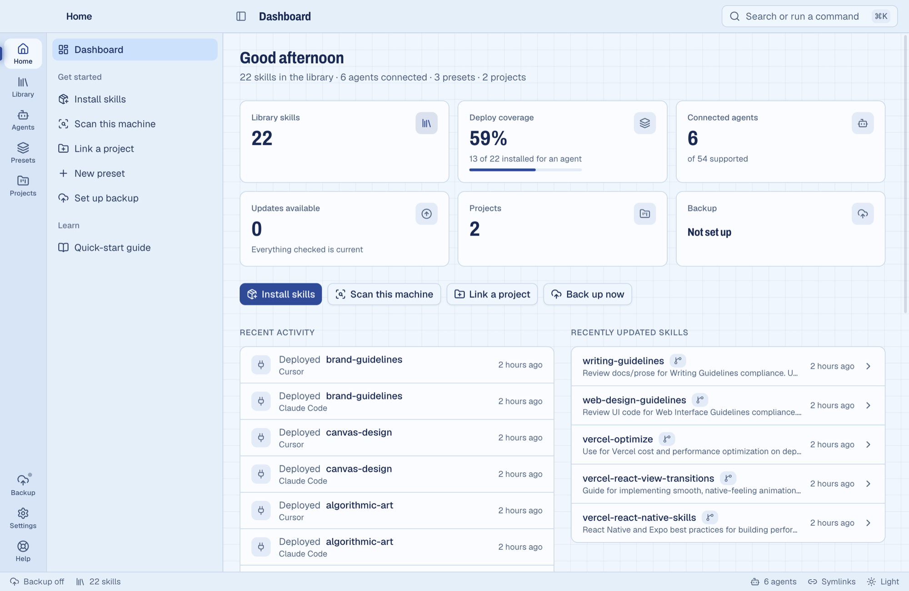
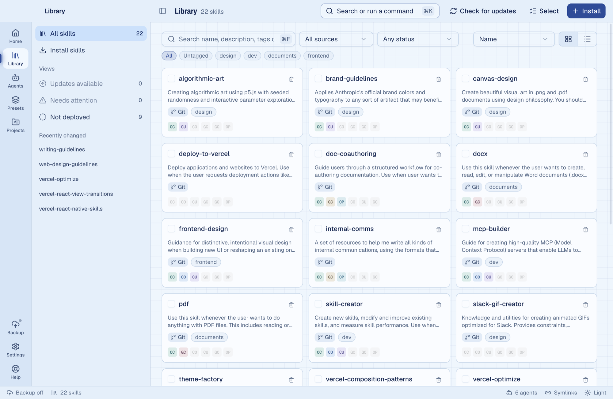
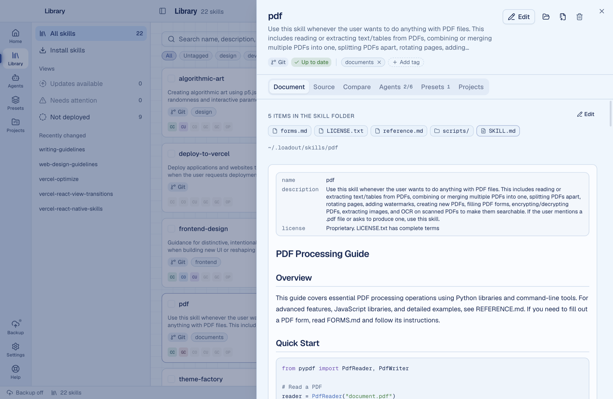
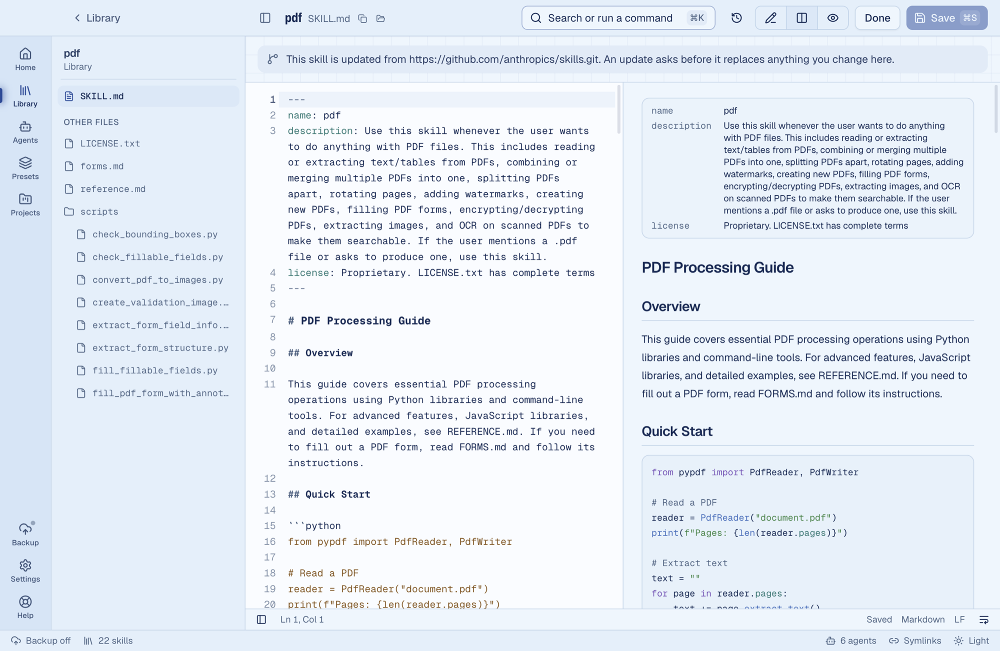
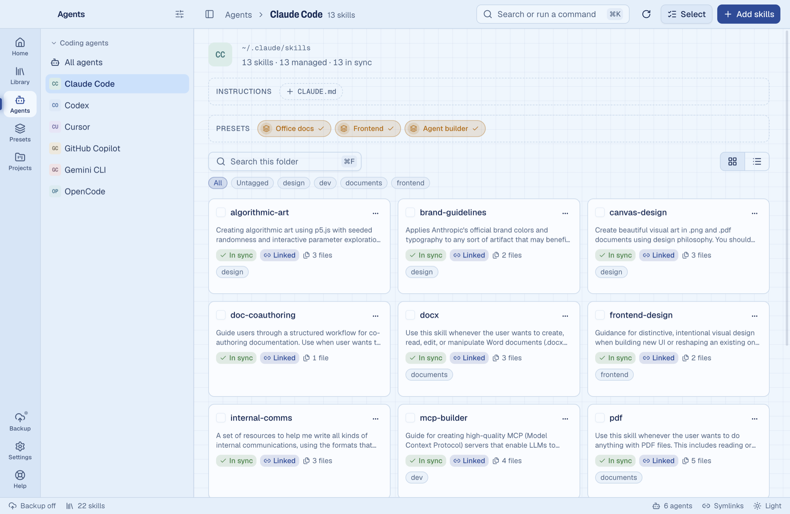
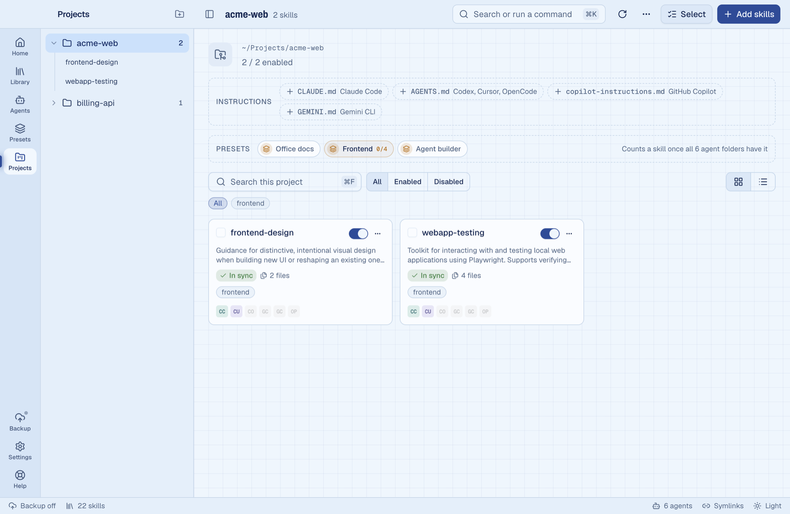
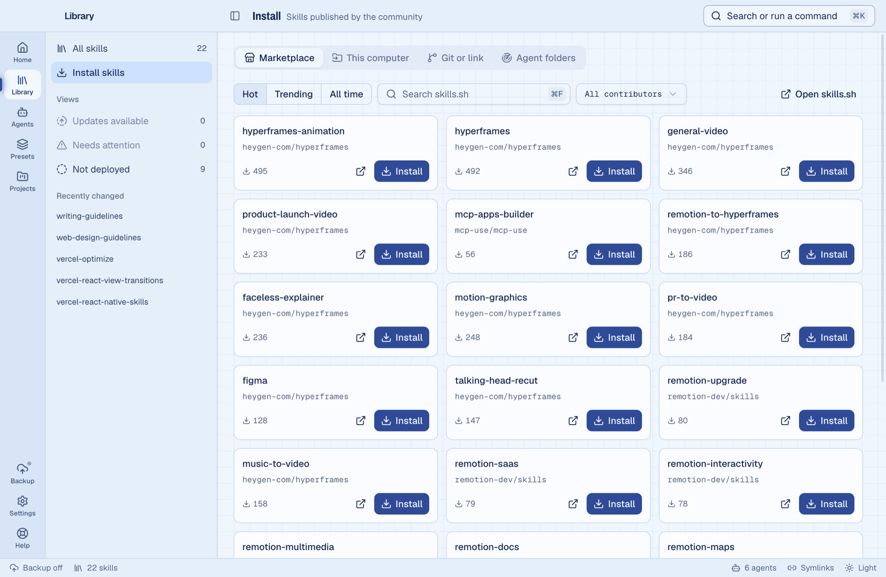
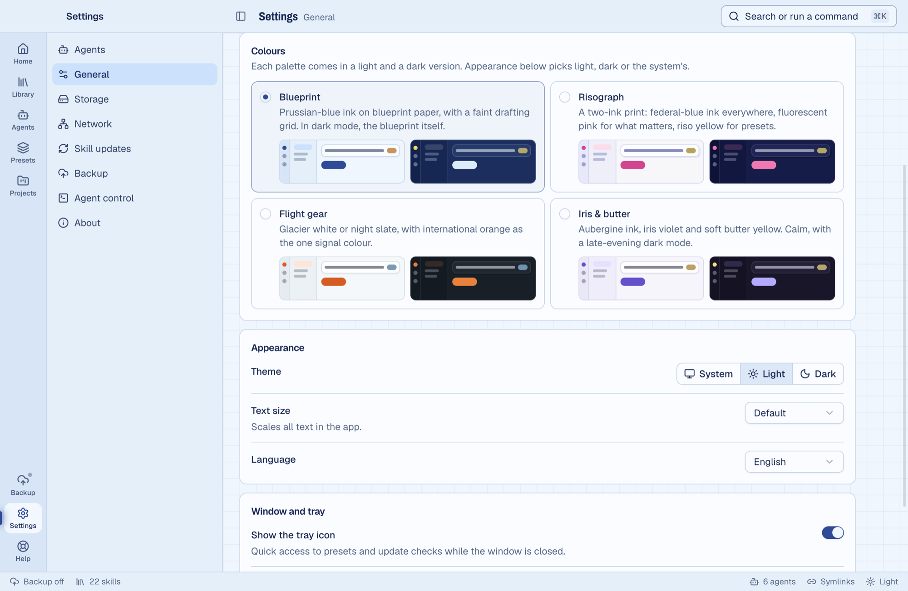
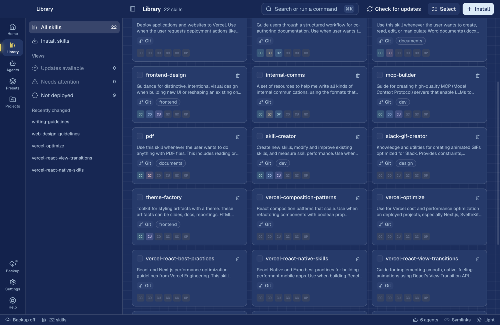

# Loadout

One desktop app to manage AI agent skills across every coding tool.

A skill is a folder with a `SKILL.md`. Loadout keeps every skill in one library
(`~/.loadout`) and deploys it, by symlink or copy, into the skills folder of each agent you
use: Claude Code, Codex, Cursor, Gemini CLI, GitHub Copilot and 49 more.



## Install

Download the installer for your system from the
[latest release](https://github.com/antick/loadout/releases/latest).

The builds are not signed with an Apple or Windows certificate yet, so macOS and Windows ask
for one extra click the first time. [docs/INSTALL.md](docs/INSTALL.md) says which file to pick
and exactly what to click on macOS, Windows and Linux. After the first start, Loadout updates
itself.

## Screenshots

**Library.** Every skill in one place, with its source, tags and the agents it is deployed to.



**A skill.** The rendered `SKILL.md`, its files, where it came from, and switches per agent.



**Editor.** Edit any file of a skill with a live preview. Every save keeps the version it replaced.



**An agent.** Everything in the agent's skills folder, its instruction file, and presets to apply in one click.



**A project.** Skills that live inside a project, per agent, with the project's instruction files.



**Install.** Browse the skills.sh marketplace, or install from a folder, a `.zip`, a Git repository or a link.



**Colours.** Four palettes (Blueprint, Risograph, Flight gear, Iris & butter), each with a light and a dark version. Pick one in Settings or from the status bar; Loadout remembers it.





## Features

- **Library:** one folder for every skill, with search, tags, filters, batch actions and checks against the Agent Skills format.
- **Editor:** edit any file of a skill with a live preview, the last 20 versions kept, and no silent overwrite of changes made on disk.
- **Install:** from a folder, a `.zip` or `.skill` file, a download link, a Git repository (Git itself is optional) or the skills.sh marketplace.
- **Agents:** 54 agents built in and found automatically, plus custom agents, custom folders and agents inside WSL.
- **Deploying:** give a skill to any agent in one click, by symlink or copy, without ever touching a folder Loadout didn't create.
- **Instruction files:** edit `CLAUDE.md`, `AGENTS.md`, `GEMINI.md` and the rest, globally and per project.
- **Agent workspaces:** see everything in an agent's skills folder, compare it with the library, and adopt skills installed elsewhere.
- **Presets:** named groups of skills you turn on for an agent or a project in one click.
- **Projects:** manage the skills inside each project, per agent, and keep them in step with the library.
- **Skill updates:** check sources on a schedule, see what an update would change, then update one skill or all of them.
- **Backup and sync:** back the library up to a private Git repository and keep several computers in step, with conflicts you resolve.
- **Command line:** a `loadout` CLI with JSON output, and a bundled skill that lets your agents manage skills themselves.
- **App updates:** Loadout updates itself and checks every download against the release checksum.
- **Storage:** everything lives in `~/.loadout`, with sizes, clean-up, a movable library and a remove-everything button.
- **App:** dashboard, command palette (`⌘K`), keyboard shortcuts, four colour palettes in light and dark, tray icon and status bar.

Every feature in detail, current limitations and what still needs testing:
[docs/FEATURES.md](docs/FEATURES.md).

## Run locally

1. Install Node.js 22.12 or newer and Git. Use the pnpm version pinned in the
   `packageManager` field of [package.json](package.json), currently `12.4.2`:

   ```bash
   npm install --global pnpm@12.4.2
   ```

2. Open a terminal in your Loadout checkout. For this machine:

   ```bash
   cd /Users/pankaj/Projects/personal/loadout
   ```

   On another machine, use the folder where you cloned this repository.

3. Confirm the tools are available:

   ```bash
   node --version
   pnpm --version
   git --version
   ```

4. Install the project dependencies:

   ```bash
   pnpm install
   ```

5. Start the app:

   ```bash
   pnpm dev
   ```

   This builds the CLI and opens the Electron desktop app with development reload.
   Keep the terminal running. The real app opens in its own window; you do not need
   to open a browser or start a separate backend.

6. Stop development with `Ctrl+C` in that terminal. Run `pnpm dev` again next time.

No `.env` file or GitHub sign-in is required for basic local use. The default library
is `~/.loadout`; development uses your real library and agent folders.

## First use

1. If the first-run backup prompt appears, choose to start fresh or restore an existing backup.
2. Open **Install** and import a local folder/archive, a Git repository, or a marketplace skill.
3. Open **Agents**, select an agent, and use **Add Skills** to deploy skills from the library.
   Installing into the library alone does not deploy a skill to an agent.
4. Use **Presets** to group skills, or add a project to manage its project-local skills.
5. Optionally configure Git backup. A personal access token or Git remote URL works now;
   GitHub device sign-in requires an OAuth Client ID in **Settings → Backup**.

## CLI examples

Run these from the repository root:

```bash
pnpm cli --help
pnpm cli skills list
pnpm cli agents list
pnpm cli skills install /path/to/my-skill
pnpm cli skills deploy my-skill --agent claude_code --agent codex
pnpm cli skills status my-skill
```

Replace the example path, skill name and agent keys with your own. The app also publishes
the CLI to `~/.loadout/bin/loadout` when it starts. To let an agent manage skills,
use the agent-control setup card on the Dashboard.

## Development commands

| Command        | What it does                                  |
| -------------- | --------------------------------------------- |
| `pnpm dev`     | Build the CLI, then start the app with reload |
| `pnpm check`   | oxlint, oxfmt check, typecheck, all tests     |
| `pnpm test`    | vitest across packages                        |
| `pnpm build`   | Build the CLI and desktop app                 |
| `pnpm format`  | Format with oxfmt                             |
| `pnpm package` | Build installers into `apps/desktop/release`  |
| `pnpm cli …`   | Run the CLI from source                       |

## Website

`apps/landing` is the landing page at [loadout.potion.sh](https://loadout.potion.sh), an Astro
static site. `pnpm exec turbo run build --filter=@loadout/landing` builds it. Vercel builds and
serves it from `vercel.json`; links such as where installers are downloaded live in
`apps/landing/src/lib/site.ts`. The agent list on the page comes from `@loadout/shared`, so it
always matches the app.

## Releases

GitHub Actions runs `pnpm check` on Linux and macOS for every push to `main` and every pull
request (`.github/workflows/ci.yml`).

Installers are published as GitHub releases of this repository. The app's update check reads
`latest.json` from the newest published release, and the landing page links there.

`.github/workflows/release.yml` builds macOS (Apple Silicon and Intel, DMG and ZIP), Windows
(NSIS installer) and Linux (AppImage and DEB, x64 and arm64) installers and the standalone CLI
executables. It then writes `latest.json` (version, and per system the download link, size and
SHA-256) with `apps/desktop/scripts/update-feed.mjs`, and puts everything in a **draft** release.

### Cut a release

1. Set the new version in `apps/desktop/package.json` and commit it.
2. Tag the commit with that version and push the tag, for example for 0.2.0:

   ```bash
   git tag v0.2.0
   git push origin v0.2.0
   ```

   Or run **Release builds** by hand from this repository's Actions tab.

3. When the workflow finishes, open github.com/antick/loadout/releases, check the draft and click
   **Publish release**.

Publishing puts the release live. Every running copy of Loadout offers it within six hours, or
right away through Settings → About → Check for updates. A draft is invisible to users and to
the update check.

A tag that doesn't match the version in `apps/desktop/package.json` stops the workflow. Don't
mark a release as a pre-release: the update check only sees the newest full release.

### Test an update locally

Updates can be tried end to end on one Mac without publishing anything:

1. Build two versions: `pnpm build`, then in `apps/desktop` run
   `pnpm exec electron-builder --config electron-builder.yml --mac zip --arm64 --publish never`
   once as is and once with `-c.extraMetadata.version=0.1.1` added.
2. Unzip the older zip somewhere you can write to, with `ditto -x -k <zip> <folder>`.
3. Put the newer zip in its own folder. Write its feed with
   `node apps/desktop/scripts/update-feed.mjs <folder> --version 0.1.1 --base-url http://127.0.0.1:8765`,
   and serve the folder with `python3 -m http.server 8765 --bind 127.0.0.1`.
4. Start the older app with `LOADOUT_UPDATE_FEED=http://127.0.0.1:8765/latest.json` set, and click
   **Update**, then **Restart now**.

`LOADOUT_UPDATE_FEED` is also the only way a development build (`pnpm dev`) checks for updates;
a development build never replaces itself.

## Layout

| Path              | Purpose                                            |
| ----------------- | -------------------------------------------------- |
| `apps/desktop`    | Electron main, preload and the React renderer      |
| `apps/landing`    | Landing page at loadout.potion.sh                  |
| `packages/core`   | All behaviour, plain Node TypeScript (no Electron) |
| `packages/cli`    | The `loadout` command-line tool                    |
| `packages/shared` | Types, API contract, events, settings, formatters  |

See [docs/ARCHITECTURE.md](docs/ARCHITECTURE.md) for the rules and
[docs/PLAN.md](docs/PLAN.md) for the feature checklist, and [TODO.md](TODO.md) for pending work.

## License

Loadout is free software under the [GNU General Public License v3.0](LICENSE) (`GPL-3.0-only`).
You may use, change and share it. If you distribute it or a changed version, you must share the
source under the same license.
